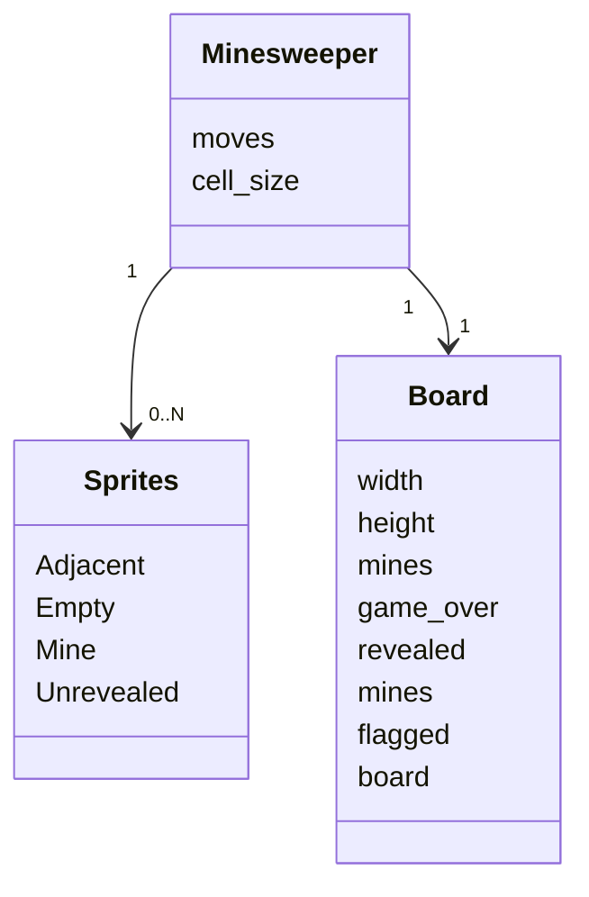
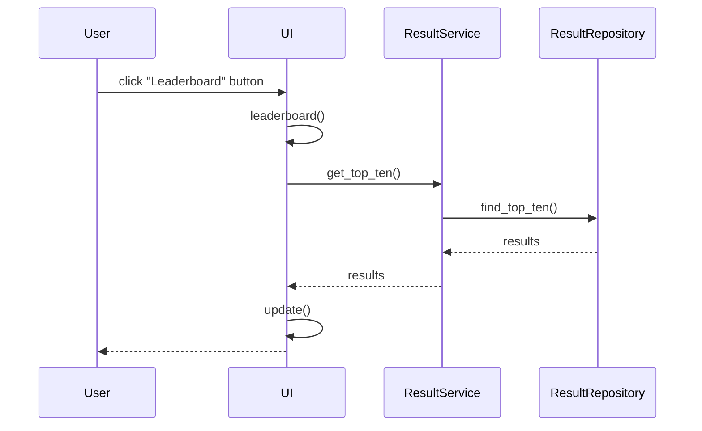
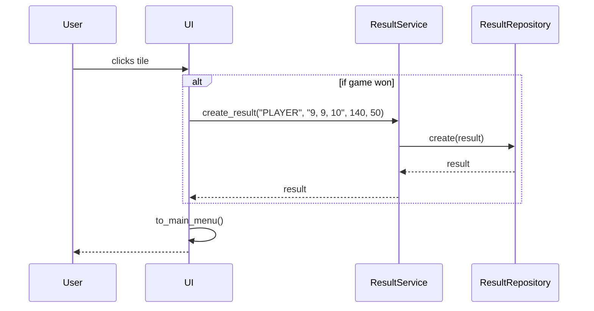
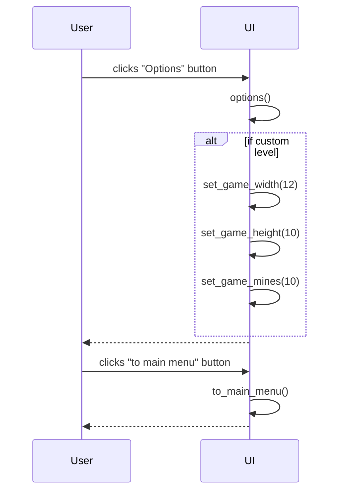
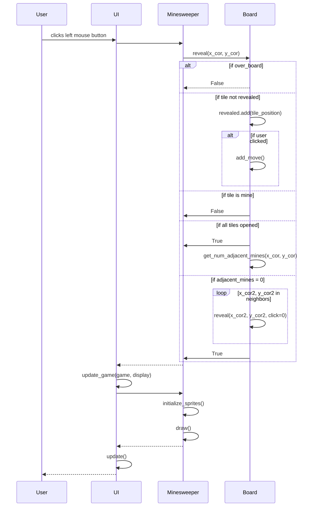

# Arkkitehtuurikuvaus

## Rakenne
Ohjelman pakkausrakenne:


Pakkaus ui vastaa käyttöliittymästä, game vastaa sovelluslogiikasta ja repository vastaa pelitietojen säilömisestä. Sprites-luokan objektit vastaavat pelin graafisista elementeistä.

## Käyttöliittymä

Käyttöliittymässä on päävalikko (Main menu), jossa on neljä eri toimintoa ja näkymää:
 - Play (aloittaa pelin)
 - Options (muokkaa asetuksia)
 - Leaderboard (tarkastele tilastoja)
 - Quit (lopettaa ohjelman)

UI-luokka vastaa siitä mikä näkymä näytetään käyttäjälle. Käyttöliittymä hyödyntää ResultServiceä tilastojen tallentamiseen ja näyttämiseen käyttäjälle, ja peliä pelattaessa kutsutaan Minesweeper-luokan oliota, joka vastaa pelilogiikasta yhdessä Board-luokan kanssa.

## Sovelluslogiikka

Minesweeper-luokan olio vastaa pelin toiminnallisuuksista yhdessä Board-luokan kanssa. Jos peli päättyy voittoon, tallennetaan tulos tietokantaan kutsumalla UI-luokassa ResultServiceä.



Luokka/pakkauskaavio, joka kuvaa Minesweeper-luokan suhdetta muihin osiin:


Miinaharavapelin tilasta vastaavia metodeita ovat:
- ```initialize_tile_sprite(x_cor, y_cor, tile_content)```
- ```get_unflagged_mines()```
- ```is_lost()```
- ```is_won()```
- ```show_mines()```

Miinaharavapelin kentän toiminnallisista kokonaisuuksista vastaa Board-luokan metodit:
- ```reveal(x_cor, y_cor)```
- ```add_flag(x_cor, y_cor)```
- ```remove_flag(x_cor, y_cor)```

ResultService pääsee tietokantaan ResultRepository-luokan kautta, joka injektoidaan konstruktorikutsussa. ResultService-luokan toiminnalliset metodit ovat:
- ```create_result(username, level, time, moves)```
- ```get_results()```
- ```get_top_ten()```

UI-luokka vastaa käyttäjän kanssa kommunikoinnista. Sen toiminnallisista kokonaisuuksista vastaavia metodeita ovat:
- ```menu_loop()```
- ```hanlde_menu_events()```
- ```start()```
- ```options()```
- ```leaderboard()```
- ```credits()```
- ```main_menu()```

## Tietojen tallennus

Repository-luokan ResultRepository vastaa tietojen säilömisestä SQLite-tietokantaan.

Sovelluksessa on konfiguraatiotiedosto .env, joka määrittää tietokannan nimen.
Pelitulokset tallennetaan SQLite-tietokannan "results" tauluun. Tietokanta alustetaan init_database.py-tiedostossa.

## Päätoiminnallisuudet

Alla on kuvattuna ohjelman päätoiminnallisuudet sekvenssikaavioina.

### Pelin aloitus ja pelikentän luominen

Sekvenssikaavio kuvaa tilannetta, kun käyttäjä klikkaa "Play"-nappia ja aloitetaan uusi peli.


UI-luokan tapahtumankäsittelijä kutsuu omaa metodiaan start, joka luo uuden Minesweeper-luokan olion. Minesweeper-luokka luo Board-olion, joka vastaa sovelluksen pelikentän logiikasta. Board-olio asettaa miinat satunnaisesti kentälle. Tämän jälkeen kontrolli siirtyy takaisin Minesweeper-luokan oliolle, joka alustaa graafisista elementeistä vastuussa olevat sprite-luokat. Tämän jälkeen Minesweeper-luokan olio kutsuu Board-luokan metodia get_board, joka palauttaa pelikentän kaksiuloitteisena listana. Listasta käydään silmukassa läpi kaikki pelikentän ruudut koordinaateittain (x, y) ja alustetaan ruutu initialize_tile_sprite metodilla. Metodi alustaa ruudun sen perusteella mikä on pelikentän ruudun sisältö ja onko ruutua vielä avattu tai liputettu. Alkutilanteessa kaikki spritet ovat avaamattomia eli ne ovat luokasta Unrevealed. Kun silmukka on käyty läpi, lisätään alustettu sprite-luokka all_sprites-ryhmään. Kontrolli palaa takaisin UI-luokkaan, joka kutsuu Minesweeper-luokan olion metodia draw ja piirtää pelikentän ikkunaan. UI-luokka päivittää ikkunan, jolloin pelikenttä ilmestyy käyttäjän ruudulle.

### Tilastojen tarkasteleminen

Sekvenssikaavio kuvaa tilannetta, kun sovellus on käynnistetty ja käyttäjä klikkaa "Leaderboard"-nappia.


UI-luokan tapahtumankäsittelijä kutsuu ResultService-luokan metodia get_top_ten().
ResultServicen metodi get_top_ten() kutsuu ResultRepositoryn luokan metodia find_top_ten(), joka palauttaa korkeintaan 10 parasta tulosta listana. UI päivittää näkymän ja piirtää ikkunaan tulokset näkyville. 

### Pelituloksen luominen

Sekvenssikaavio kuvaa tilannetta, kun peli on päättynyt ja pelitulos tallennetaan tietokantaan.


Jos peli päättyy käyttäjän voittoon, UI-luokasta kutsutaan ResultService luokan metodia create_result, jolle annetaan parametriksi käyttäjänimi, vaikeustaso (merkkijonona muodossa "leveys, korkeus, miinojen_lkm"), kulunut aika, tehtyjen siirtojen määrä. 
ResultService kutsuu luokan ResultRepository metodia create, joka luo uuden tuloksen ja tallentaa sen tietokantaan.
UI päivittää ikkunan ja käyttäjä palaa takaisin päävalikkoon.

### Peliasetusten muuttaminen

Sekvenssikaavio kuvaa tilannetta, missä käyttäjä vaihtaa asetuksista vaikeustasoksi Custom ja asettaa leveydeksi 12, korkeudeksi 10 ja miinojen lukumääräksi 10 ja klikkaa takaisin päävalikkoon.



### Ruudun avaaminen

Sekvenssikaavio kuvaa tilannetta, kun käyttäjä on peli-ikkunassa ja klikkaa ruutua hiiren vasemmalla painikkeella.



### Muut toiminnallisuudet

Muut toiminnallisuudet, kuten ruutujen liputus tai asetusten muuttaminen toimivat vastaavasti, eli UI-tapahtumankäsittelijä kutsuu sovelluslogiikan tarjoamaa sopivaa metodia. Kun kontrolli päätyy takaisin UI-luokalle, päivitetään uusi näkymä käyttäjälle.

## Kehitysehdotus rakenteeseen

Board-luokassa on pylint-tarkistustuksen mukaan liian monta oliomuuttujaa. Tämän voisi korjata käyttämällä esimerkiksi pelikentän dimensioiden tallennukseen sanakirjaa.

