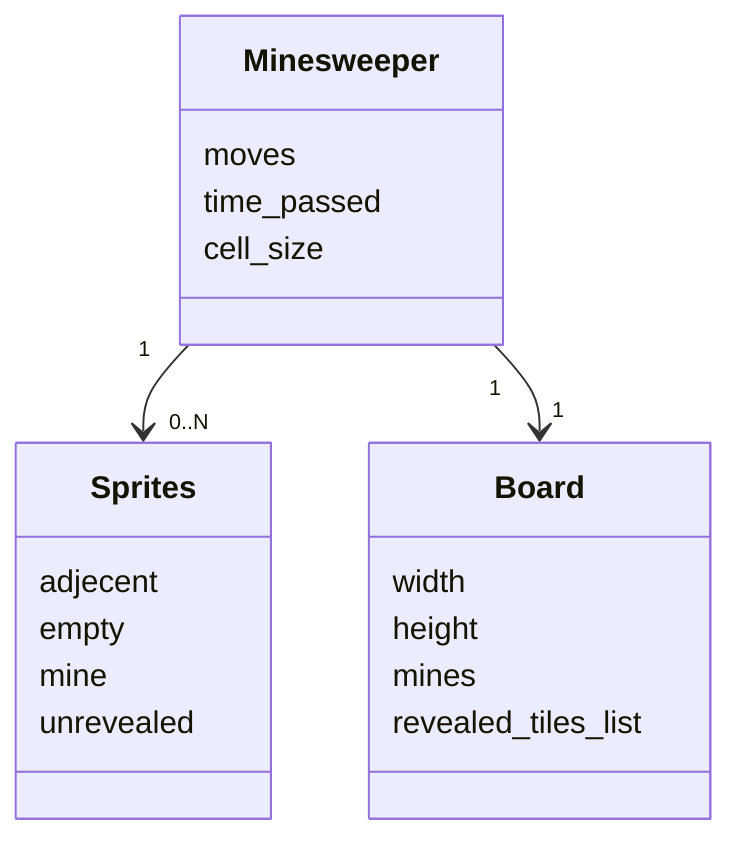
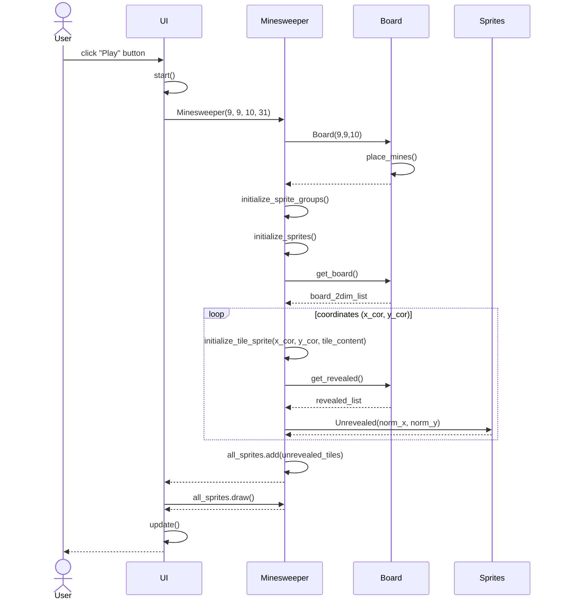

# Arkkitehtuurikuvaus

## Rakenne
Ohjelman pakkausrakenne:

Pakkaus ui vastaa käyttöliittymästä, minesweeper ja board vastaavat sovelluslogiikasta ja sprites vastaa pelin graafisista elementeistä.

## Käyttöliittymä

Käyttöliittymässä on main menu, jossa neljä eri toimintoa ja näkymää:
 - Play (aloittaa pelin)
 - Options (muokkaa asetuksia)
 - Leaderboard (tarkastele tilastoja)
 - Quit (lopettaa ohjelman)

UI-luokka vastaa siitä mikä näkymä näytetään käyttäjälle.

## Sovelluslogiikka

Minesweeper-luokan olio vastaa pelin toiminnallisuuksista yhdessä Board-luokan kanssa.

Luokka/pakkauskaavio, joka kuvaa Minesweeper-luokan suhdetta muihin osiin:

## Päätoiminnallisuudet

### Pelin aloitus ja pelikentän luominen

