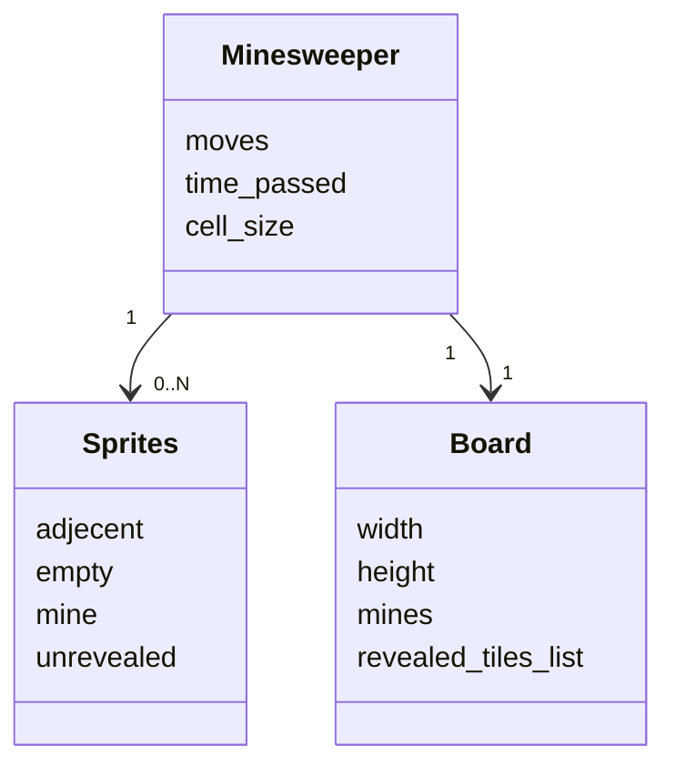
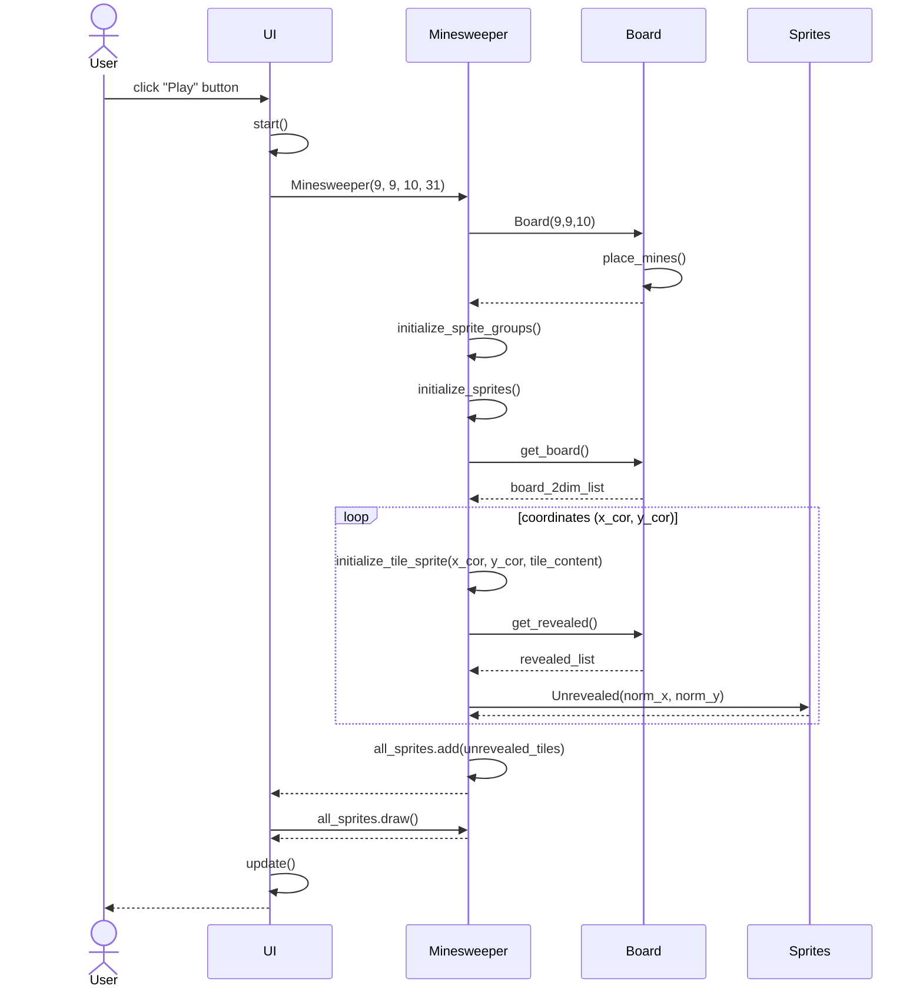
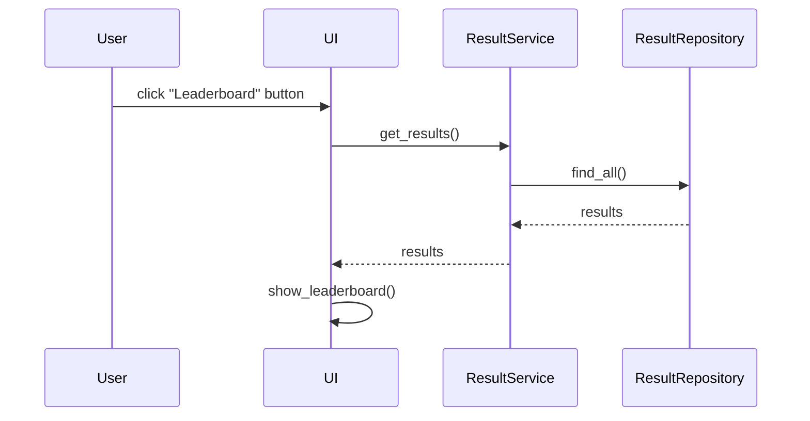
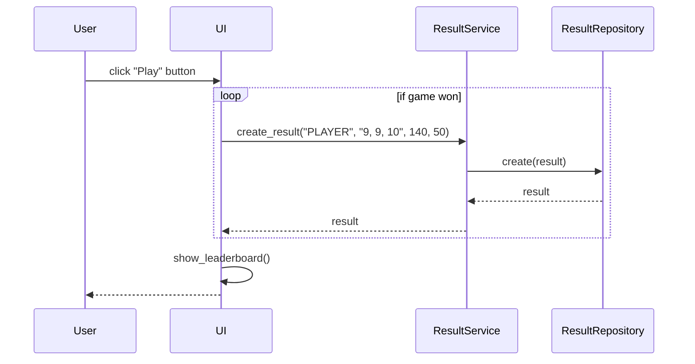

# Arkkitehtuurikuvaus

## Rakenne
Ohjelman pakkausrakenne:

Pakkaus ui vastaa käyttöliittymästä, minesweeper, board ja service vastaavat sovelluslogiikasta ja repository vastaa pelitietojen säilömisestä. Sprites-luokan objektit vastaavat pelin graafisista elementeistä.

## Käyttöliittymä

Käyttöliittymässä on päävalikko (Main menu), jossa neljä eri toimintoa ja näkymää:
 - Play (aloittaa pelin)
 - Options (muokkaa asetuksia)
 - Leaderboard (tarkastele tilastoja)
 - Quit (lopettaa ohjelman)

UI-luokka vastaa siitä mikä näkymä näytetään käyttäjälle. Käyttöliittymä hyödyntää ResultServiceä tilastojen näyttämiseen käyttäjälle ja peliä pelattaessa kutsutaan Minesweeper-luokan oliota, joka vastaa pelilogiikasta.

## Sovelluslogiikka

Minesweeper-luokan olio vastaa pelin toiminnallisuuksista yhdessä Board-luokan kanssa. Jos peli päättyy voittoon, tallennetaan tulos tietokantaan kutsumalla ResultServiceä.

Luokka/pakkauskaavio, joka kuvaa Minesweeper-luokan suhdetta muihin osiin:

ResultService pääsee tietokantaan ResultRepository-luokan kautta, joka injektoidaan konstruktorikutsussa.

## Päätoiminnallisuudet

Alla on kuvattuna ohjelman päätoiminnallisuudet sekvenssikaavioina.

### Pelin aloitus ja pelikentän luominen

Sekvenssiokaavio kuvaa tilannetta, kun käyttäjä klikkaa "Play"-nappia ja aloitetaan uusi peli.

UI-luokan tapahtumankäsittelijä kutsuu omaa metodiaan start, joka luo uuden Minesweeper-luokan olion. Minesweeper-luokka luo Board-olion, joka vastaa sovelluksen pelikentän logiikasta. Board-olio asettaa miinat satunnaisesti kentälle. Tämän jälkeen kontrolli siirtyy takaisin Minesweeper-luokan oliolle, joka alustaa graafisista elementeistä vastuussa olevat sprite-luokat. Tämän jälkeen Minesweeper-luokan olio kutsuu Board-luokan metodia get_board, joka palauttaa pelikentän kaksiuloitteisena listana. Listasta käydään silmukassa läpi kaikki pelikentän ruudut koordinaateittain (x, y) ja alustetaan ruutu initialize_tile_sprite metodilla. Metodi alustaa ruudun sisällön sen perusteella mikä on pelikentän ruudun sisältö ja onko ruutua vielä avattu tai liputettu. Alkutilanteessa kaikki spritet ovat avaamattomia eli ne ovat luokasta Unrevealed. Kun silmukka on käyty läpi, lisätään alustettu sprite-luokka all_sprites-ryhmään. Kontrolli palaa takaisin UI-luokkaan, joka kutsuu Minesweeper-luokan olion metodia draw ja piirtää pelikentän ikkunaan. UI-luokka päivittää ikkunan, jolloin pelikenttä ilmestyy käyttäjän ruudulle.

### Tilastojen tarkasteleminen

Sekvenssikaavio kuvaa tilannetta, kun sovellus on käynnistetty ja käyttäjä klikkaa "Leaderboard"-nappia.

UI-luokan tapahtumankäsittelijä kutsuu ResultService-luokan metodia get_results().
ResultServicen metodi get_results() kutsuu ResultRepositoryn luokan metodia find_all(), joka palauttaa kaikki tulokset listana.
UI päivittää näkymän ja piirtää ikkunaan tulokset näkyville funktiolla show_leaderboard().

### Pelituloksen luominen

Sekvenssikaavio kuvaa tilannetta, kun sovellus on käynnistetty ja käyttäjä klikkaa "Play"-nappia.

Jos peli päättyy käyttäjän voittoon, UI-luokasta kutsutaan ResultService luokan metodia create_result, jolle annetaan parametriksi käyttäjänimi, vaikeustaso (merkkijonona muodossa "leveys, korkeus, miinojen_lkm"), kulunut aika, tehtyjen siirtojen määrä. 
ResultService kutsuu luokan ResultRepository metodia create, joka luo uuden tuloksen ja tallentaa sen tietokantaan.
UI päivittää ikkunan ja käyttäjälle näytetään uusin Leaderboard-tilasto.