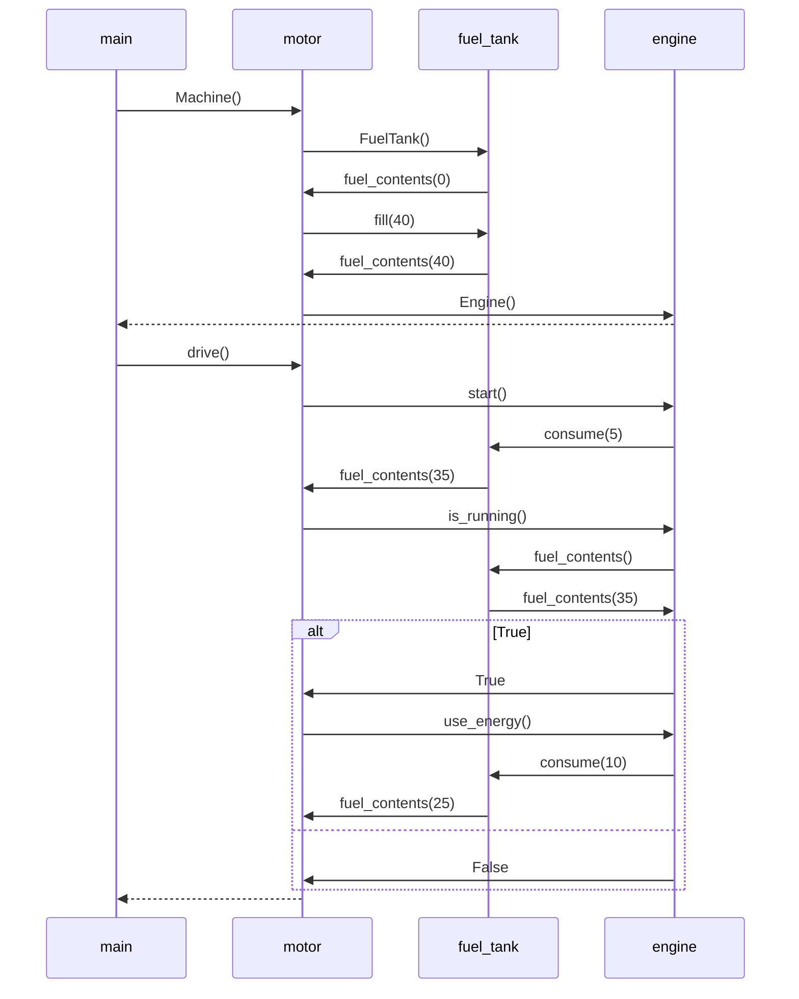

## Tehtävän kuvaus

Tarkastellaan bensatankista ja moottorista koostuvan koneen Python-koodia.
Piirrä sekvenssikaaviona tilanne, jossa kutsutaan (jostain koodin ulkopuolella olevasta metodista) ensin Machine-luokan konstruktoria ja sen jälkeen luodun Machine-olion metodia drive.

