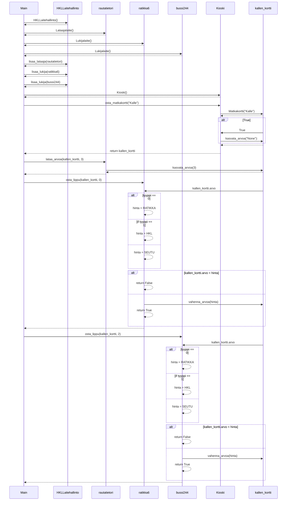

## Tehtävän kuvaus

Tarkastellaan HSL-matkakorttien hallintaan käytettävää koodia.
Kuvaa sekvenssikaaviona koodin main-funktion suorituksen aikaansaama toiminnallisuus.

```mermaid
sequenceDiagram
  Participant Main
  Participant HKLLaitehallinto
  Participant rautatietori
  Participant ratikka6
  Participant bussi244
  Participant Kioski
  Participant kallen_kortti

  Main ->> HKLLaitehallinto: HKLLaitehallinto()
  HKLLaitehallinto -->> Main: 
  Main ->> rautatietori: Lataajalaite()
  rautatietori -->> Main: 
  Main ->> ratikka6: Lukijalaite()
  ratikka6 -->> Main: 
  Main ->> bussi244: Lukijalaite()
  bussi244 -->> Main: 

  Main ->> HKLLaitehallinto: lisaa_lataaja(rautatietori)
  HKLLaitehallinto -->> Main: 
  Main ->> HKLLaitehallinto: lisaa_lukija(ratikka6)
  HKLLaitehallinto -->> Main: 
  Main ->> HKLLaitehallinto: lisaa_lukija(bussi244)
  HKLLaitehallinto -->> Main: 

  Main ->> Kioski: Kioski()
  Kioski -->> Main: 
  Main ->> Kioski: osta_matkakortti("Kalle")
  Kioski ->> kallen_kortti: Matkakortti("Kalle")
  kallen_kortti -->> Kioski: 
  alt True
    kallen_kortti ->> Kioski: True
    Kioski ->> kallen_kortti: kasvata_arvoa("None"): 
  end
  kallen_kortti -->> Kioski: 
  Kioski -->> Main: return kallen_kortti

  Main ->> rautatietori: lataa_arvoa(kallen_kortti, 3)
  rautatietori ->> kallen_kortti: kasvata_arvoa(3)
  kallen_kortti -->> rautatietori: 
  rautatietori -->> Main: 

  Main ->> ratikka6: osta_lippu(kallen_kortti, 0)
  kallen_kortti ->> ratikka6: kallen_kortti.arvo
  alt tyyppi == 0
    ratikka6-->>ratikka6: hinta = RATIKKA
  else if tyyppi == 1
    ratikka6-->>ratikka6: hinta = HKL
  else
    ratikka6-->>ratikka6: hinta = SEUTU
  end
  alt kallen_kortti.arvo < hinta
    ratikka6-->>ratikka6: return False
  else
    ratikka6->>kallen_kortti: vahenna_arvoa(hinta)
    ratikka6-->>ratikka6: return True
  end
  ratikka6 -->> Main: 

  Main ->> bussi244: osta_lippu(kallen_kortti, 2)
  kallen_kortti ->> bussi244: kallen_kortti.arvo
  alt tyyppi == 0
    bussi244-->>bussi244: hinta = RATIKKA
  else if tyyppi == 1
    bussi244-->>bussi244: hinta = HKL
  else
    bussi244-->>bussi244: hinta = SEUTU
  end
  alt kallen_kortti.arvo < hinta
    bussi244-->>bussi244: return False
  else
    bussi244->>kallen_kortti: vahenna_arvoa(hinta)
    bussi244-->>bussi244: return True
  end
  bussi244 -->> Main: 
```